# ActivityPub Database UML Diagram

## Entity Relationship Diagram

```mermaid
erDiagram
    peers_participants {
    string ptn_id PK "The unique ActivityPub Actor URI for this participant"
    string ptn_handle UK "Human-readable handle/username for this participant"
    string display_name "Display name for this participant"
    string profile_uri "URI for the participant's profile"
    string inbox_uri "URI for the participant's inbox"
    string outbox_uri "URI for the participant's outbox"
    string followers_uri "URI for the participant's followers collection"
    string following_uri "URI for the participant's following collection"
    string public_key "Public key for verification"
    string key_id "Key identifier for signature verification"
    string signature_algorithm "Algorithm used for signatures (e.g., 'rsa-sha256')"
    string webfinger_subject "WebFinger subject (e.g., 'acct:user@example.com')"
    string preferred_locale "Preferred language/locale for this participant"
    timestamp touched_at "When this participant was first seen"
}
    
    peers_touches {
        bigint id PK "Snowflake ID"
        string touch_uri UK "The machine-readable, globally unique URI for this touch, used for federation."
        string origin_ptn_id FK "The ptn_id of the participant who created this touch."
        string touch_type "The ActivityPub object type (e.g., 'Note', 'Article', 'Image')."
        string body_content "The main content of the touch, formatted in HTML or Markdown."
        string warning "A summary or content warning for the touch, which can be displayed to hide the main body content."
        string web_url "The human-readable URL to the HTML representation of this touch, for browsers and link previews."
        string reply_target_uri "Touch URI this touch replies to (threading)"
        boolean requires_consent "A flag indicating if the touch requires explicit consent before being displayed."
        boolean sensitive "Whether content is sensitive and requires content warning"
        string spoiler_text "Content warning/spoiler text for sensitive content"
        string moderation_status "Content moderation status: 'pending', 'approved', 'rejected'"
        string language "Language code of the content (e.g., 'en', 'zh', 'ja')"
        string context "JSON-LD context for extended ActivityPub features"
        timestamp touched_at "When touch was first published"
        timestamp modified_at "Last touch modification"
    }

    peers_touch_recipients {
        bigint touch_id FK "Internal ID of the touch"
        string recipient_ptn_id FK "The ptn_id of the recipient"
        string delivery_type "Type of delivery: 'to' or 'cc'"
    }
    
    peers_touch_act_follows {
        bigint id PK "Snowflake ID"
        string activity_uri UK "Unique ActivityPub Follow Activity ID"
        string follower_ptn_id FK "ptn_id - Participant who is following"
        string followed_ptn_id FK "ptn_id - Participant being followed"
        boolean show_reblogs "Whether to show reblogs from this account"
        boolean notify "Whether to enable notifications for this follow"
        string languages "Array of language codes to filter posts by"
        timestamp touched_at "When this follow activity was created"
    }
    
    peers_touch_act_likes {
        bigint id PK "Snowflake ID"
        string activity_uri UK "Unique ActivityPub Like Activity ID"
        string liker_ptn_id FK "ptn_id - Participant who liked the touch"
        string target_touch_uri "Touch URI that was liked"
        timestamp touched_at "When this like activity was created"
    }
    
    peers_touch_act_creates {
        bigint id PK "Snowflake ID"
        string activity_uri UK "Unique ActivityPub Create Activity ID"
        string creator_ptn_id FK "ptn_id - Participant who created the touch"
        bigint created_touch_id FK "Internal ID of touch created by this activity"
        timestamp touched_at "When this create activity was performed"
    }
    
    peers_touch_act_updates {
        bigint id PK "Snowflake ID"
        string activity_uri UK "Unique ActivityPub Update Activity ID"
        string updater_ptn_id FK "ptn_id - Participant who updated the touch"
        string target_touch_uri "Touch URI that was updated"
        timestamp touched_at "When this update activity was performed"
    }
    
    peers_touch_act_deletes {
        bigint id PK "Snowflake ID"
        string activity_uri UK "Unique ActivityPub Delete Activity ID"
        string deleter_ptn_id FK "ptn_id - Participant who deleted the touch"
        string target_touch_uri "Touch URI that was deleted"
        timestamp touched_at "When this delete activity was performed"
    }
    
    peers_touch_act_announces {
        bigint id PK "Snowflake ID"
        string activity_uri UK "Unique ActivityPub Announce Activity ID"
        string announcer_ptn_id FK "ptn_id - Participant who announced the touch"
        string target_touch_uri "Touch URI that was announced"
        timestamp touched_at "When this announce activity was performed"
    }
    
    peers_followers {
        bigint id PK "Snowflake ID of the Follow Activity"
        string subscriber_ptn_id FK "ptn_id - Participant who is following"
        string publisher_ptn_id FK "ptn_id - Participant being followed"
        boolean relationship_status "Whether the follow is active"
        timestamp touched_at "When this follow relationship was established"
    }
    
    peers_inbox_meta {
        bigint id PK "Snowflake ID"
        string inbox_id UK "Unique identifier for the inbox (e.g., owner_id)"
        string owner_participant FK "The ptn_id of the participant who owns this inbox"
        integer item_count "The total number of items in the inbox"
        bigint first_item_id "ID of the first item for pagination"
        bigint last_item_id "ID of the last item for pagination"
        string current_page "Current page cursor for pagination"
        string next_page "Next page cursor for pagination"
        string prev_page "Previous page cursor for pagination"
        timestamp touched_at "Timestamp when the inbox was created"
        timestamp modified_at "Timestamp of the last update to the inbox"
    }
    
    peers_outbox_meta {
        bigint id PK "Snowflake ID"
        string outbox_id UK "Unique identifier for the outbox (e.g., owner_id)"
        string owner_participant FK "The ptn_id of the participant who owns this outbox"
        integer item_count "The total number of items in the outbox"
        bigint first_item_id "ID of the first item for pagination"
        bigint last_item_id "ID of the last item for pagination"
        string current_page "Current page cursor for pagination"
        string next_page "Next page cursor for pagination"
        string prev_page "Previous page cursor for pagination"
        timestamp touched_at "Timestamp when the outbox was created"
        timestamp modified_at "Timestamp of the last update to the outbox"
    }
    
    peers_inbox_contents {
        bigint sequence_id PK "Snowflake ID, used for chronological ordering."
        bigint parent_inbox_id FK "The internal id of the inbox this item belongs to."
        bigint linked_activity_id FK "The internal id of the linked activity, if the item is an activity."
        bigint linked_touch_id FK "The internal id of the linked touch, if the item is a touch object."
        timestamp added_at "The timestamp when the item was added to the inbox."
    }
    
    peers_outbox_contents {
        bigint sequence_id PK "Snowflake ID, used for chronological ordering."
        bigint parent_outbox_id FK "The internal id of the outbox this item belongs to."
        bigint linked_activity_id FK "The internal id of the linked activity, if the item is an activity."
        bigint linked_touch_id FK "The internal id of the linked touch, if the item is a touch object."
        timestamp added_at "The timestamp when the item was added to the outbox."
    }
    
    peers_touch_media_refs {
        bigint id PK "Snowflake ID"
        string attachment_uri UK "The unique ActivityPub Object URI for this media attachment."
        bigint parent_touch_id FK "The internal id of the touch that this media is attached to."
        string media_url "The direct URL to the media file."
        string media_category "The category of the media (e.g., 'image', 'video', 'audio')."
        string original_name "The original filename of the media."
        integer byte_size "The size of the media file in bytes."
        integer pixel_width "The width of the media in pixels (for images and videos)."
        integer pixel_height "The height of the media in pixels (for images and videos)."
        string placeholder_hash "A hash (like BlurHash) used to generate a placeholder image while the full media loads."
        string accessibility_text "A description of the media for accessibility purposes (alt text)."
        timestamp touched_at "The timestamp when the media was attached to the touch."
    }
    
    peers_touch_act_undo {
        bigint id PK "Snowflake ID"
        string activity_uri UK "Unique ActivityPub Undo Activity ID"
        string undoer_ptn_id FK "ptn_id - Participant who performed the undo"
        string target_activity_uri "Activity URI that was undone"
        timestamp touched_at "When this undo activity was performed"
    }
    
    peers_touch_act_accept {
        bigint id PK "Snowflake ID"
        string activity_uri UK "Unique ActivityPub Accept Activity ID"
        string accepter_ptn_id FK "ptn_id - Participant who accepted"
        string target_activity_uri "Activity URI that was accepted"
        timestamp touched_at "When this accept activity was performed"
    }
    
    peers_touch_act_reject {
        bigint id PK "Snowflake ID"
        string activity_uri UK "Unique ActivityPub Reject Activity ID"
        string rejecter_ptn_id FK "ptn_id - Participant who rejected"
        string target_activity_uri "Activity URI that was rejected"
        timestamp touched_at "When this reject activity was performed"
    }
    
    peers_touch_act_block {
        bigint id PK "Snowflake ID"
        string activity_uri UK "Unique ActivityPub Block Activity ID"
        string blocker_ptn_id FK "ptn_id - Participant who performed the block"
        string blocked_ptn_id FK "ptn_id - Participant who was blocked"
        timestamp touched_at "When this block activity was performed"
    }
    
    peers_instances {
        string domain PK "The domain name of the instance"
        string software_name "Name of the ActivityPub software (e.g., 'Mastodon', 'Pleroma')"
        string software_version "Version of the software"
        integer rate_limit "Rate limit in requests per minute"
        integer max_post_size "Maximum post size in characters"
        boolean supports_media "Whether the instance supports media uploads"
        boolean supports_emoji "Whether the instance supports custom emoji"
        timestamp first_seen "When this instance was first discovered"
        timestamp last_seen "When we last received activity from this instance"
        boolean is_blocked "Whether we have blocked this instance"
    }
    
    peers_delivery_status {
        bigint id PK "Snowflake ID"
        string activity_uri FK "Activity URI being delivered"
        string target_instance "Domain of the target instance"
        string status "Delivery status: 'pending', 'delivered', 'failed'"
        integer retry_count "Number of delivery attempts"
        timestamp last_attempt "Timestamp of last delivery attempt"
        string error_message "Error message if delivery failed"
        timestamp touched_at "When this delivery status was created"
    }

    peers_participants ||--o{ peers_touches : "originates"
    peers_participants ||--o{ peers_touch_act_follows : "follows as"
    peers_participants ||--o{ peers_touch_act_follows : "is followed by"
    peers_participants ||--o{ peers_touch_act_likes : "likes as"
    peers_participants ||--o{ peers_touch_act_creates : "creates as"
    peers_participants ||--o{ peers_touch_act_updates : "updates as"
    peers_participants ||--o{ peers_touch_act_deletes : "deletes as"
    peers_participants ||--o{ peers_touch_act_announces : "announces as"
    peers_participants ||--o{ peers_touch_act_undo : "undoes as"
    peers_participants ||--o{ peers_touch_act_accept : "accepts as"
    peers_participants ||--o{ peers_touch_act_reject : "rejects as"
    peers_participants ||--o{ peers_touch_act_block : "blocks as"
    peers_participants ||--o{ peers_followers : "subscribes as"
    peers_participants ||--o{ peers_followers : "publishes as"
    peers_participants ||--o{ peers_inbox_meta : "owns"
    peers_participants ||--o{ peers_outbox_meta : "owns"
    peers_participants ||--o{ peers_touch_recipients : "receives"
    
    peers_touches ||--o{ peers_touches : "replies to"
    peers_touches ||--o{ peers_touch_media_refs : "contains"
    peers_touches ||--o{ peers_touch_recipients : "is delivered to"
    peers_touches ||--o{ peers_delivery_status : "has delivery status"
    
    peers_touch_act_creates ||--o{ peers_touches : "creates"
    peers_touch_act_follows ||--o{ peers_touch_act_undo : "can be undone"
    peers_touch_act_likes ||--o{ peers_touch_act_undo : "can be undone"
    peers_touch_act_announces ||--o{ peers_touch_act_undo : "can be undone"
    peers_touch_act_block ||--o{ peers_touch_act_undo : "can be undone"
    
    peers_inbox_meta ||--o{ peers_inbox_contents : "contains"
    peers_outbox_meta ||--o{ peers_outbox_contents : "contains"
    
    peers_instances ||--o{ peers_delivery_status : "receives deliveries"
    
    peers_inbox_contents ||--o{ peers_touch_act_follows : "links to"
    peers_inbox_contents ||--o{ peers_touch_act_likes : "links to"
    peers_inbox_contents ||--o{ peers_touch_act_creates : "links to"
    peers_inbox_contents ||--o{ peers_touch_act_updates : "links to"
    peers_inbox_contents ||--o{ peers_touch_act_deletes : "links to"
    peers_inbox_contents ||--o{ peers_touch_act_announces : "links to"
    peers_inbox_contents ||--o{ peers_touch_act_undo : "links to"
    peers_inbox_contents ||--o{ peers_touch_act_accept : "links to"
    peers_inbox_contents ||--o{ peers_touch_act_reject : "links to"
    peers_inbox_contents ||--o{ peers_touch_act_block : "links to"
    peers_inbox_contents ||--o{ peers_touches : "links to"
    peers_outbox_contents ||--o{ peers_touch_act_follows : "links to"
    peers_outbox_contents ||--o{ peers_touch_act_likes : "links to"
    peers_outbox_contents ||--o{ peers_touch_act_creates : "links to"
    peers_outbox_contents ||--o{ peers_touch_act_updates : "links to"
    peers_outbox_contents ||--o{ peers_touch_act_deletes : "links to"
    peers_outbox_contents ||--o{ peers_touch_act_announces : "links to"
    peers_outbox_contents ||--o{ peers_touch_act_undo : "links to"
    peers_outbox_contents ||--o{ peers_touch_act_accept : "links to"
    peers_outbox_contents ||--o{ peers_touch_act_reject : "links to"
    peers_outbox_contents ||--o{ peers_touch_act_block : "links to"
    peers_outbox_contents ||--o{ peers_touches : "links to"
```

## Table Descriptions & Relationships

### Core Entities

#### peers_participants
**Purpose**: Master identity registry for all federation participants.
- **Generated URLs**:
  - **Inbox URL**: `{ptn_id}/inbox`
  - **Outbox URL**: `{ptn_id}/outbox`
  - **Followers URL**: `{ptn_id}/followers`
  - **Following URL**: `{ptn_id}/following`
- **Relationships**:
  - One participant can originate many `peers_touches`
  - One participant can initiate many `activity_log` entries
  - One participant can be both subscriber and publisher in `relationship_matrix`
  - One participant owns multiple `activity_streams`

#### peers_touches
**Purpose**: Stores federated "touches" (content objects like posts, articles, or images).
- **Foreign Keys**:
  - `origin_ptn_id` → `peers_participants.ptn_id`
  - `reply_target_uri` → `peers_touches.touch_uri` (self-referencing for threading)
- **Relationships**:
  - Many touches can reply to one parent touch
  - One touch can have many media attachments
  - One touch can be delivered to many recipients

#### peers_touch_act_follows
**Purpose**: Records Follow activities between participants, forming the social graph.
- **Foreign Keys**:
  - `follower_ptn_id` → `peers_participants.ptn_id`
  - `followed_ptn_id` → `peers_participants.ptn_id`
- **Unique Constraint**: `(follower_ptn_id, followed_ptn_id)` prevents duplicate follows
- **Relationships**: Represents asymmetric follow relationships between participants

#### peers_touch_act_likes
**Purpose**: Records Like activities where participants express appreciation for touches.
- **Foreign Keys**:
  - `liker_ptn_id` → `peers_participants.ptn_id`
- **Relationships**: Links participants to the touches they like

#### peers_touch_act_creates
**Purpose**: Records Create activities where participants create new touches.
- **Foreign Keys**:
  - `creator_ptn_id` → `peers_participants.ptn_id`
  - `created_touch_id` → `peers_touches.id`
- **Relationships**: Links creators to the touches they create

#### peers_touch_act_updates
**Purpose**: Records Update activities where participants modify existing touches.
- **Foreign Keys**:
  - `updater_ptn_id` → `peers_participants.ptn_id`
- **Relationships**: Links participants to the touches they update

#### peers_touch_act_deletes
**Purpose**: Records Delete activities where participants remove touches.
- **Foreign Keys**:
  - `deleter_ptn_id` → `peers_participants.ptn_id`
- **Relationships**: Links participants to the touches they delete

#### peers_touch_act_announces
**Purpose**: Records Announce (boost/reblog) activities where participants share touches.
- **Foreign Keys**:
  - `announcer_ptn_id` → `peers_participants.ptn_id`
- **Relationships**: Links participants to the touches they announce

#### peers_touch_act_undo
**Purpose**: Records Undo activities where participants reverse previous actions like follows, likes, or announces.
- **Foreign Keys**:
  - `undoer_ptn_id` → `peers_participants.ptn_id`
- **Relationships**: Links participants to the activities they undo

#### peers_touch_act_accept
**Purpose**: Records Accept activities where participants accept follow requests or other activities.
- **Foreign Keys**:
  - `accepter_ptn_id` → `peers_participants.ptn_id`
- **Relationships**: Links participants to the activities they accept

#### peers_touch_act_reject
**Purpose**: Records Reject activities where participants reject follow requests or other activities.
- **Foreign Keys**:
  - `rejecter_ptn_id` → `peers_participants.ptn_id`
- **Relationships**: Links participants to the activities they reject

#### peers_touch_act_block
**Purpose**: Records Block activities where participants block other participants.
- **Foreign Keys**:
  - `blocker_ptn_id` → `peers_participants.ptn_id`
  - `blocked_ptn_id` → `peers_participants.ptn_id`
- **Relationships**: Links participants to the participants they block

#### peers_instances
**Purpose**: Stores information about remote ActivityPub instances for federation management.
- **Primary Key**: `domain`
- **Relationships**: Tracks instance capabilities and restrictions for optimized federation

#### peers_delivery_status
**Purpose**: Tracks the delivery status of activities to remote instances.
- **Foreign Keys**:
  - `activity_uri` → Various activity tables
- **Relationships**: Links activities to their delivery status across different instances

#### peers_followers
**Purpose**: Tracks `Follow` relationships between participants, forming the social graph.
- **Primary Key**: `id`
- **Unique Constraint**: `(subscriber_ptn_id, publisher_ptn_id)`
- **Foreign Keys**: `subscriber_ptn_id`, `publisher_ptn_id`
- **Ordering**: `touched_at DESC`
- **Relationships**: Represents asymmetric relationships between participants
- **Follow Relationship Optimization**: The `peers_followers` table uses a composite unique constraint on `(subscriber_ptn_id, publisher_ptn_id)` to prevent duplicate relationships and optimize follower/following queries.

### Collection Management

#### peers_inbox_meta
**Purpose**: Manages metadata for ActivityPub inbox collections.
- **Primary Key**: `id`
- **Foreign Keys**: `owner_participant` → `peers_participants.ptn_id`
- **Unique Constraint**: `inbox_id`
- **Ordering**: `touched_at DESC` for most recent inboxes
- **Relationships**: Each participant has one inbox for receiving activities.

#### peers_outbox_meta
**Purpose**: Manages metadata for ActivityPub outbox collections.
- **Primary Key**: `id`
- **Foreign Keys**: `owner_participant` → `peers_participants.ptn_id`
- **Unique Constraint**: `outbox_id`
- **Ordering**: `touched_at DESC` for most recent outboxes
- **Relationships**: Each participant has one outbox for sending activities.

#### peers_inbox_contents
**Purpose**: Stores items within ActivityPub inbox collections.
- **Primary Key**: `sequence_id`
- **Foreign Keys**: 
  - `parent_inbox_id` → `peers_inbox_meta.inbox_id`
  - `linked_activity_id` → `peers_touch_act_follows.id` (or other activity tables)
  - `linked_touch_id` → `peers_touches.id`
- **Ordering**: `sequence_id` for chronological ordering within inbox
- **Relationships**: Links activities and touches to their containing inbox.

#### peers_outbox_contents
**Purpose**: Stores items within ActivityPub outbox collections.
- **Primary Key**: `sequence_id`
- **Foreign Keys**: 
  - `parent_outbox_id` → `peers_outbox_meta.outbox_id`
  - `linked_activity_id` → `peers_touch_act_follows.id` (or other activity tables)
  - `linked_touch_id` → `peers_touches.id`
- **Ordering**: `sequence_id` for chronological ordering within outbox
- **Relationships**: Links activities and touches to their containing outbox.

### Media Management

#### peers_touch_media_refs
**Purpose**: Stores metadata for media attachments, linking them to the touches they belong to.
- **Foreign Key**: `parent_touch_id` → `peers_touches.id`
- **Relationships**: One touch can have many media attachments

## Cardinality Summary

- **peers_participants** to **peers_touches**: One-to-Many (One participant can create many touches)
- **peers_participants** to **peers_touch_act_follows**: One-to-Many (One participant can follow many others)
- **peers_participants** to **peers_touch_act_likes**: One-to-Many (One participant can like many touches)
- **peers_participants** to **peers_touch_act_creates**: One-to-Many (One participant can create many touches)
- **peers_participants** to **peers_touch_act_updates**: One-to-Many (One participant can update many touches)
- **peers_participants** to **peers_touch_act_deletes**: One-to-Many (One participant can delete many touches)
- **peers_participants** to **peers_touch_act_announces**: One-to-Many (One participant can announce many touches)
- **peers_participants** to **peers_followers**: One-to-Many (One participant can have many follow relationships)
- **peers_participants** to **peers_inbox_meta**: One-to-Many (One participant can have one inbox)
- **peers_participants** to **peers_outbox_meta**: One-to-Many (One participant can have one outbox)
- **peers_participants** to **peers_touch_recipients**: One-to-Many (One participant can be a recipient of many touches)
- **peers_touches** to **peers_touches**: One-to-Many (One touch can have many replies)
- **peers_touches** to **peers_touch_media_refs**: One-to-Many (One touch can have many media attachments)
- **peers_touches** to **peers_touch_recipients**: One-to-Many (One touch can be delivered to many recipients)
- **peers_touch_act_creates** to **peers_touches**: One-to-One (One create activity creates one touch)
- **peers_inbox_meta** to **peers_inbox_contents**: One-to-Many (One inbox can contain many items)
- **peers_outbox_meta** to **peers_outbox_contents**: One-to-Many (One outbox can contain many items)
- **peers_inbox_contents** to **peers_touch_act_follows**: One-to-Many (One inbox can contain many follow activities)
- **peers_inbox_contents** to **peers_touch_act_likes**: One-to-Many (One inbox can contain many like activities)
- **peers_inbox_contents** to **peers_touch_act_creates**: One-to-Many (One inbox can contain many create activities)
- **peers_inbox_contents** to **peers_touch_act_updates**: One-to-Many (One inbox can contain many update activities)
- **peers_inbox_contents** to **peers_touch_act_deletes**: One-to-Many (One inbox can contain many delete activities)
- **peers_inbox_contents** to **peers_touch_act_announces**: One-to-Many (One inbox can contain many announce activities)
- **peers_inbox_contents** to **peers_touches**: One-to-Many (One inbox can contain many touches)
- **peers_outbox_contents** to **peers_touch_act_follows**: One-to-Many (One outbox can contain many follow activities)
- **peers_outbox_contents** to **peers_touch_act_likes**: One-to-Many (One outbox can contain many like activities)
- **peers_outbox_contents** to **peers_touch_act_creates**: One-to-Many (One outbox can contain many create activities)
- **peers_outbox_contents** to **peers_touch_act_updates**: One-to-Many (One outbox can contain many update activities)
- **peers_outbox_contents** to **peers_touch_act_deletes**: One-to-Many (One outbox can contain many delete activities)
- **peers_outbox_contents** to **peers_touch_act_announces**: One-to-Many (One outbox can contain many announce activities)
- **peers_outbox_contents** to **peers_touch_act_undo**: One-to-Many (One outbox can contain many undo activities)
- **peers_outbox_contents** to **peers_touch_act_accept**: One-to-Many (One outbox can contain many accept activities)
- **peers_outbox_contents** to **peers_touch_act_reject**: One-to-Many (One outbox can contain many reject activities)
- **peers_outbox_contents** to **peers_touch_act_block**: One-to-Many (One outbox can contain many block activities)
- **peers_outbox_contents** to **peers_touches**: One-to-Many (One outbox can contain many touches)
- **peers_participants** to **peers_touch_act_undo**: One-to-Many (One participant can perform many undo activities)
- **peers_participants** to **peers_touch_act_accept**: One-to-Many (One participant can perform many accept activities)
- **peers_participants** to **peers_touch_act_reject**: One-to-Many (One participant can perform many reject activities)
- **peers_participants** to **peers_touch_act_block**: One-to-Many (One participant can perform many block activities)
- **peers_touches** to **peers_delivery_status**: One-to-Many (One touch can have many delivery status records)
- **peers_instances** to **peers_delivery_status**: One-to-Many (One instance can receive many deliveries)

## Index Strategy

### Primary Access Patterns
1. **Participant Lookup**: `ptn_id` (PK) and `ptn_handle` (UK)
2. **Touch Timeline**: `origin_ptn_id` + `touched_at DESC`
3. **Follow Activities**: `follower_ptn_id` + `created_at DESC` and `followed_ptn_id` + `created_at DESC`
4. **Like Activities**: `liker_ptn_id` + `created_at DESC`
5. **Create Activities**: `creator_ptn_id` + `created_at DESC`
6. **Update Activities**: `updater_ptn_id` + `created_at DESC`
7. **Delete Activities**: `deleter_ptn_id` + `created_at DESC`
8. **Announce Activities**: `announcer_ptn_id` + `created_at DESC`
9. **Thread Navigation**: `reply_target_uri` for conversation threading
10. **Inbox Contents**: `parent_inbox_id` + `sequence_id` for ordered inbox items
11. **Outbox Contents**: `parent_outbox_id` + `sequence_id` for ordered outbox items
### Additional Access Patterns
1. **Followers List**: `WHERE publisher_ptn_id = ? ORDER BY touched_at DESC` (peers_followers)
2. **Following List**: `WHERE subscriber_ptn_id = ? ORDER BY touched_at DESC` (peers_followers)
3. **Likes on a Touch**: `target_touch_uri` + `created_at DESC`
4. **Announces on a Touch**: `target_touch_uri` + `created_at DESC`
5. **Inbox Retrieval**: `WHERE owner_participant = ?` (peers_inbox_meta)
6. **Outbox Retrieval**: `WHERE owner_participant = ?` (peers_outbox_meta)
7. **Inbox Contents**: `WHERE parent_inbox_id = ? ORDER BY sequence_id ASC` (peers_inbox_contents)
8. **Outbox Contents**: `WHERE parent_outbox_id = ? ORDER BY sequence_id ASC` (peers_outbox_contents)
9. **Media Attachments**: `parent_touch_id` for all media of a touch
10. **Recipients of a Touch**: `touch_id` for all recipients of a touch
11. **Undo Activities**: `undoer_ptn_id` + `touched_at DESC`
12. **Accept Activities**: `accepter_ptn_id` + `touched_at DESC`
13. **Reject Activities**: `rejecter_ptn_id` + `touched_at DESC`
14. **Block Activities**: `blocker_ptn_id` + `touched_at DESC` and `blocked_ptn_id` + `touched_at DESC`
15. **Instance Lookup**: `domain` for instance information
16. **Delivery Status**: `activity_uri` + `target_instance` for delivery tracking
17. **Failed Deliveries**: `status = 'failed'` + `last_attempt` for retry management
18. **Content Moderation**: `moderation_status` for content review
19. **Sensitive Content**: `sensitive = true` for content warning handling
20. **Language-based Filtering**: `language` for multilingual content discovery

### Benefits of Type-Specific Activity Tables
1. **Eliminates URI Confusion**: By removing the `target_collection_uri` field and having each activity type use its own `target_touch_uri` field, we eliminate the confusion between different target URI types.
2. **Improved Query Performance**: Queries for specific activity types are more efficient as they only scan relevant tables rather than filtering a large monolithic table.
3. **Type Safety**: Each activity table has columns specifically tailored to its needs, preventing invalid data combinations and reducing the need for nullable columns.
4. **Simplified Application Logic**: Application code can be specialized for each activity type, making it easier to understand and maintain.
5. **Better Indexing Strategy**: Each table can have indexes optimized for its specific access patterns, rather than having to balance competing needs in a single table.
6. **Scalability**: As the system grows, high-volume activity types can be optimized independently without affecting others.
7. **Clearer Semantics**: The database schema more closely matches the ActivityPub vocabulary, making it easier to understand and implement federation logic.
8. **Follow Mastodon's Proven Approach**: This design follows the pattern used by Mastodon, which has been proven to work well at scale for federated social networks.