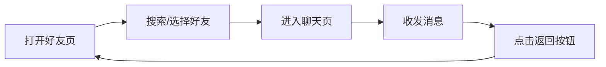

# APP 聊天模块需求文档（微信风格）

## 一、文档基础信息
| 项目     | 说明                 |
| ------ | ------------------ |
| 模块名称   | 好友管理 + 实时聊天闭环模块    |
| 目标平台   | 移动端（iOS/Android）   |
| 参考标杆   | 微信（联系人页 + 单聊页交互逻辑） |
| 核心用户价值 | 快速管理好友关系，流畅收发消息    |
| 版本     | V1.0               |

## 二、整体功能框架

### 2.1 模块组成
模块包含两个核心页面，形成完整用户流程：

1.  **好友页（联系人页）**：好友关系管理 + 聊天入口
*   作用：用户查看 / 搜索 / 管理好友，从这里发起聊天
1.  **聊天页（单聊页）**：实时消息交互
*   作用：与指定好友收发消息，查看聊天历史

### 2.2 核心流程闭环


## 三、好友页（联系人页）详细需求

### 3.1 页面布局（参考微信 “联系人” tab）

| 区域    | 设计细节                                                                                                                                                                                                                                                   |
| ----- | ------------------------------------------------------------------------------------------------------------------------------------------------------------------------------------------------------------------------------------------------------ |
| 顶部导航栏 | - 标题：“联系人”（居中，18px，加粗）- 右侧按钮：“+” 图标（24px，触发 “添加好友” 菜单）- 背景：白色，底部 1px 浅灰边框（#F2F2F2）                                                                                                                                                                     |
| 搜索栏   | - 样式：浅灰背景（#F5F5F5），圆角 20px，内边距 8px 16px- 提示文字：“搜索联系人”（14px，#999999）- 左侧图标：搜索图标（16px，#999999）- 功能：输入时实时过滤好友（匹配姓名 / 备注，不区分大小写）                                                                                                                           |
| 联系人分组 | - 分组逻辑：按姓名首字母 A-Z 分组，右侧显示 A-Z 快捷导航栏（12px，#666666）- 固定分组：  ① 星标好友（顶部，带黄色星标图标 #FFCC00）  ② 最近聊天（可选，显示 5 个最新聊天好友）  ③ 我的好友（所有好友，按首字母排序）                                                                                                                     |
| 好友列表项 | - 左侧：好友头像（圆形，40x40px，无边框）- 中间：  ① 主文本：好友备注 / 姓名（16px，#333333，有未读消息时加粗）  ② 副文本：最新消息预览（12px，#999999，无历史消息时隐藏）- 右侧：  ① 未读徽章：红色圆形（#FF3B30，18px），内显未读数量（12px 白色，最多显示 “99+”）  ② 时间：最新消息时间（12px，#999999，无历史消息时隐藏）- 间距：上下内边距 12px，左右 16px，底部 1px 浅灰边框（#F2F2F2） |

### 3.2 核心功能与交互

#### 3.2.1 好友搜索与筛选

*   实时筛选：输入内容时，列表即时显示匹配的好友（含姓名 / 备注包含输入内容的好友）
*   快捷导航：点击右侧 A-Z 字母，列表直接滚动到对应首字母分组（如点击 “M”，跳转到 “马”“毛” 开头的好友）


#### 3.2.2 添加好友

1.  触发：点击顶部导航栏 “+” 图标
2.  弹出菜单（底部弹窗，白色背景，圆角 12px），包含 3 个选项：
*   ① 按 ID 添加：输入好友唯一 ID（带输入框 + 确认按钮，ID 错误时提示 “用户不存在”）
*   ② 扫码添加：打开相机扫描好友二维码（支持从相册选择二维码图片）
*   ③ 邀请好友：生成 APP 下载链接，通过短信 / 微信等渠道分享
1.  添加成功后：新好友自动加入 “我的好友” 分组，向对方发送系统消息 “XXX 已添加你为好友”


#### 3.2.3 好友管理（长按列表项）
长按好友列表项，弹出操作菜单（白色背景，圆角 8px），包含 4 个选项：

*   ① 查看资料：跳转至好友资料页（显示头像、姓名、备注、在线状态，底部有 “发消息” 按钮）
*   ② 编辑备注：弹出输入框（最多 20 字符），修改好友备注后实时更新列表显示
*   ③ 消息免打扰：开关控制（默认关闭，开启后好友消息无振动 / 铃声提醒）
*   ④ 删除好友：弹出确认弹窗（“确定要删除该联系人吗？此操作不可恢复”），删除后从列表移除，同时清空本地聊天记录

#### 3.2.4 未读消息处理

*   有未读消息的好友：列表项主文本加粗，右侧显示未读徽章
*   点击该好友：跳转至聊天页，同时清空未读徽章和加粗样式

## 四、聊天页（单聊页）详细需求

### 4.1 页面布局（参考微信单聊界面）

| 区域    | 设计细节                                                                                                                                                                                                                                                                                                         |
| ----- | ------------------------------------------------------------------------------------------------------------------------------------------------------------------------------------------------------------------------------------------------------------------------------------------------------------ |
| 顶部导航栏 | - 左侧：  ① 返回按钮：“←” 图标（24px，点击返回好友页）  ② 好友头像（圆形，32x32px，点击跳转好友资料页）- 中间：  ① 主文本：好友备注 / 姓名（18px，#333333，居中）  ② 副文本：在线状态（12px，#999999）—— 在线时显示 “在线”，离线时显示 “最后活跃时间”（如 “10 分钟前”）- 右侧：“…” 图标（24px，点击弹出菜单：查看资料、消息免打扰、聊天设置）- 背景：白色，底部 1px 浅灰边框（#F2F2F2）                                                                |
| 消息列表区 | - 背景：浅灰（#F7F7F7），可选添加轻微纸张纹理- 消息排序：按时间倒序（最新消息在底部）- 内边距：左右 16px，上下 8px- 加载更多：向上滑动到顶部时，触发历史消息加载（显示 “加载中…” 提示，12px，#999999，居中）                                                                                                                                                                                   |
| 底部输入区 | - 左侧：  ① 表情按钮：“😊” 图标（24px，点击显示 / 隐藏表情面板）  ② 附件按钮：“📎” 图标（24px，点击显示附件菜单）- 中间：文本输入框  - 样式：白色背景，圆角 20px，1px 浅灰边框（#E5E5E5），内边距 12px 16px  - 功能：支持多行输入，高度随内容自适应（最大高度 = 屏幕 1/3）  - 提示文字：“输入消息…”（16px，#999999）- 右侧：发送按钮  - 文字：“发送”（16px）  - 状态：输入框为空时灰显（#CCCCCC，不可点击）；有内容时蓝色（#07C160，可点击）- 内边距：上下 8px，左右 16px，背景白色 |

### 4.2 消息样式与交互

#### 4.2.1 消息类型与样式

| 消息类型    | 设计细节                                                                                                                                                                                                                                    |
| ------- | --------------------------------------------------------------------------------------------------------------------------------------------------------------------------------------------------------------------------------------- |
| 自己发送的消息 | - 对齐：右对齐- 气泡：浅绿背景（#D5F5C4），圆角（左上 18px，右上 4px，左下 18px，右下 4px）- 内容：文本（14px，#333333，行高 1.5，内边距 12px 16px）- 补充元素：  ① 时间：发送时间（12px，#999999，右对齐在气泡下方，默认隐藏，长按显示）  ② 状态图标：灰色对勾（“已发送”）、蓝色双对勾（“已读”），12px，在时间右侧，默认隐藏，长按显示- 间距：上下 8px，最大宽度 = 屏幕 70% |
| 对方发送的消息 | - 对齐：左对齐- 气泡：白色背景（#FFFFFF），1px 浅灰边框（#E5E5E5），圆角（左上 4px，右上 18px，左下 18px，右下 4px）- 内容：同 “自己发送的消息”- 补充元素：  ① 头像：好友头像（圆形，36x36px，在气泡左侧）  ② 时间：发送时间（12px，#999999，左对齐在气泡下方，默认隐藏，长按显示）- 间距：上下 8px，最大宽度 = 屏幕 70%                                 |
| 系统消息    | - 对齐：居中对齐- 样式：浅灰文本（12px，#999999），外层包裹 1px 浅灰边框（#E5E5E5），圆角 8px，内边距 4px 8px- 场景：日期分隔（如 “今天 14:30”“昨天”“6 月 1 日”）- 间距：上下 16px                                                                                                              |

#### 4.2.2 核心交互操作

##### （1）消息发送

*   触发方式：点击 “发送” 按钮，或按手机键盘 “回车” 键
*   发送状态：

    *   发送中：气泡下方显示 “发送中…”（12px，#999999）
    *   发送成功：切换为 “已发送”（灰色对勾）
    *   发送失败：显示红色感叹号（12px），点击可重新发送
*   发送后：输入框清空，消息列表自动滚动到底部

##### （2）消息接收

*   新消息提醒：收到消息时轻微振动（可在设置中关闭），列表自动滚动到底部
*   后台提醒：APP 在后台时，显示系统通知（含好友姓名 + 消息预览），同时更新好友页未读徽章

##### （3）输入辅助功能

*   表情面板：点击 “😊” 图标弹出，高度 180px，3 行 ×8 列表情（常用表情如😀、😂、👍），支持左右滑动，点击表情插入输入框，点击面板外区域关闭
*   附件菜单：点击 “📎” 图标弹出底部弹窗（白色背景，圆角 12px），显示 2 行 ×3 列选项（“照片”“文件”“位置”），每个选项带图标 + 文字（注：仅保留入口，暂不实现上传功能）

##### （4）消息长按操作
长按任意消息，弹出操作菜单（白色背景，圆角 8px），包含 3 个选项：

*   复制：复制消息文本到剪贴板
*   转发：跳转至好友页，选择好友后转发该消息（转发后消息上方显示 “转发” 标签，12px，#999999）
*   删除：弹出确认弹窗（“确定要删除这条消息吗？”），删除后仅本地移除，不影响对方消息

##### （5）历史消息加载

*   触发：向上滑动消息列表至顶部
*   加载状态：显示 “加载中…” 提示，加载完成后显示历史消息（每次加载 20 条）
*   无更多消息：加载到最早期消息时，显示 “没有更多消息了”（12px，#999999，居中）

## 五、技术要求

### 5.1 技术栈选择

| 类型    | 推荐方案                     |
| ----- | ------------------------ |
| 跨平台开发 | React Native / Flutter   |
| 原生开发  | iOS：Swift；Android：Kotlin |
| 实时通信  | Socket.IO（消息收发）          |
| 接口服务  | REST API（好友管理、消息同步）      |

### 5.2 核心数据模型

#### 5.2.1 好友数据模型（JSON）

```
{
&#x20; "friendId": "user\_10086",        // 好友唯一ID
&#x20; "avatarUrl": "https://xxx.com/avatar/10086.jpg", // 头像URL
&#x20; "realName": "李四",               // 好友真实姓名
&#x20; "remarkName": "李总",             // 用户设置的备注
&#x20; "onlineStatus": "offline",        // 在线状态：online/offline
&#x20; "lastActiveTime": 1720000000000,  // 最后活跃时间（时间戳，离线时显示）
&#x20; "isStarred": false,               // 是否为星标好友
&#x20; "unreadCount": 5,                 // 未读消息数
&#x20; "isMuted": false                  // 是否消息免打扰
}
```

#### 5.2.2 消息数据模型（JSON）

```
{
&#x20; "messageId": "msg\_20240601",      // 消息唯一ID
&#x20; "chatId": "chat\_user1001\_user10086", // 聊天ID（发起方ID\_接收方ID）
&#x20; "senderId": "user10086",          // 发送方ID
&#x20; "receiverId": "user1001",         // 接收方ID
&#x20; "content": "明天开会时间是10点",   // 消息内容
&#x20; "timestamp": 1720001234567,       // 发送时间（时间戳）
&#x20; "status": "read",                 // 消息状态：sending/sent/read/failed
&#x20; "isMine": false,                  // 是否为当前用户发送
&#x20; "messageType": "text",            // 消息类型：text/system
&#x20; "isForwarded": false              // 是否为转发消息
}
```

### 5.3 性能与适配要求

#### 5.3.1 性能优化

*   列表渲染：使用虚拟列表（如 React Native FlatList、Flutter ListView.builder），支持 100 + 好友 / 消息无卡顿
*   图片加载：好友头像懒加载（仅加载可视区域内头像）
*   本地缓存：好友列表缓存 7 天，聊天记录缓存最近 1000 条（超出部分按需从服务器加载）

#### 5.3.2 适配要求

*   屏幕尺寸：支持 320px-480px 宽度（覆盖主流手机尺寸）
*   横竖屏：支持横竖屏切换，布局自动适配（如横屏时输入框宽度增加）
*   系统版本：iOS 最低支持 12.0，Android 最低支持 8.0

#### 5.3.3 错误处理

| 错误场景   | 处理方案                                                                  |
| ------ | --------------------------------------------------------------------- |
| 网络离线   | 顶部显示红色提示栏（“网络连接失败，请检查网络”，14px 白色文字，#FF3B30 背景），3 秒后自动隐藏；网络恢复后自动重发失败消息 |
| 好友已删除  | 进入聊天页时，显示系统消息 “该联系人已将你删除，无法发送消息”，同时禁用输入框（灰显，不可点击）                     |
| 消息发送失败 | 消息气泡右侧显示红色感叹号，点击后重新发起发送请求                                             |

## 六、可扩展功能（V2.0 规划）

1.  媒体消息：支持发送图片、视频、语音消息
2.  消息撤回：允许撤回 2 分钟内发送的消息
3.  群聊功能：支持创建群聊、管理群成员、群消息收发
4.  消息.pin：支持将重要消息固定在聊天页顶部
5.  表情包：扩展表情面板，支持添加自定义表情包

## 七、验收标准

1.  功能完整性：好友管理（添加 / 删除 / 备注）、消息收发（发送 / 接收 / 删除 / 转发）等核心功能无 bug
2.  性能体验：列表滑动流畅（无卡顿），输入框响应延迟＜0.5 秒，消息发送成功率≥99%（网络正常时）
3.  UI 一致性：所有页面元素对齐准确，颜色 / 字体 / 间距符合文档规范，适配不同屏幕无错位
4.  错误处理：网络离线、好友删除等场景提示清晰，无闪退 / 崩溃问题
> （注：文档部分内容可能由 AI 生成）