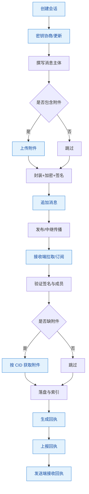
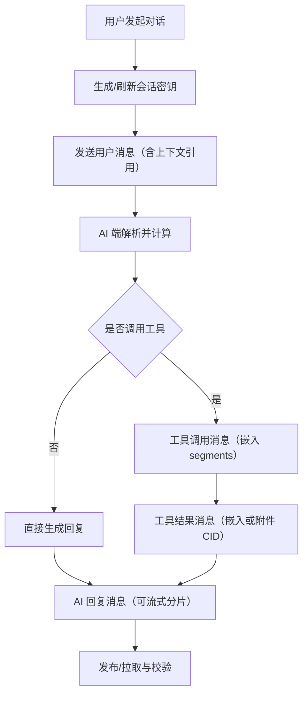
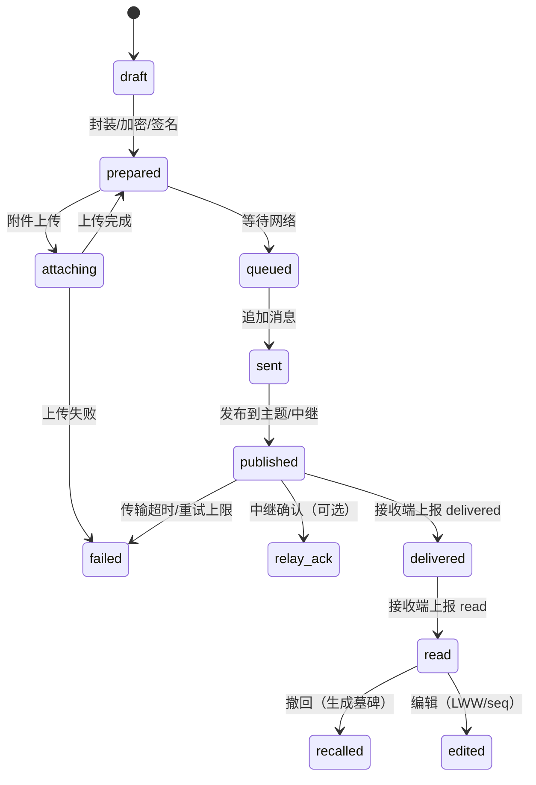
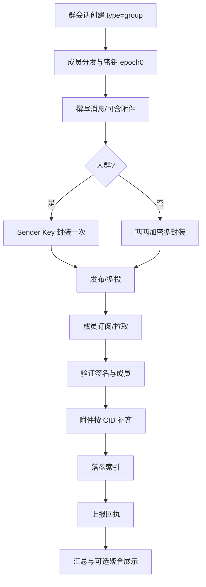

# 消息存储系统（初稿）

## 目标与范围

- 支持两类会话：用户与用户聊天、用户与 AI 聊天。
- 面向去中心化节点（P2P/Federation）设计，保障离线可用、断点续传、最终一致。
- 覆盖丰富消息类型，不仅文本，还包含多媒体、结构化与系统事件。
- 兼顾不同规模的上层服务：小型单节点、中型轻量服务、大型联邦与专用服务集群。

## 设计原则

- 端到端加密与最小可见元数据，保护隐私与抗审查。
- 追加式事件日志与可溯源内容寻址，便于同步与去重。
- 可组合的数据模型：消息主体与附件分离，索引与副本独立。
- 逐级扩展：节点本地存储为基础，按需接入对象存储、全文索引与联邦同步。

## 核心术语

- 会话 `Conversation`：一组参与者的交流上下文，包含加密状态与策略。
- 参与者 `Participant`：用户或 AI 代理，标识采用 DID/公钥指纹。
- 消息 `Message`：一次发送事件，携带主体、附件、关系与收敛信息。
- 附件 `Attachment`：二进制大对象，采用内容寻址存储（CID）。
- 反应 `Reaction`：对消息的轻量反馈（emoji、点赞）。
- 回执 `DeliveryReceipt`：送达/已读状态，按参与者独立记录。
- 线程 `Thread`：基于回复关系形成的子话题，保持因果顺序。

## 消息类型

- 文本：纯文本、Markdown、富文本片段。
- 图片：静态图、动图（GIF/WebP）、贴纸/表情。
- 音频：语音消息、长音频。
- 视频：短视频、长视频、屏幕录制。
- 文件：任意文件（PDF、代码包等）。
- 位置：经纬度、POI、显示半径。
- 联系方式：名片、邮箱/电话、社交账号。
- 链接卡片：URL 及解析出的标题、摘要、缩略图。
- 投票：选项、截止时间、匿名设置。
- 系统事件：加入/退出、权限变更、会话设置更新。
- 回复/引用：指向父消息、引用片段。
- 编辑与删除：消息内容更正、撤回，使用可审计的变更条目。
- 反应：emoji/点赞，支持撤销。
- 置顶与标签：Pin、话题标签、收藏。
- 临时消息：具备 TTL，过期自动清除并记录墓碑。
- 批量消息：批量发送或批量操作的聚合条目。
- AI 相关：
  - AI 输出：包含 role、模型信息、工具调用、流式分片。
  - 工具调用：结构化参数、函数名、执行结果。
  - 审计与轨迹：prompt、系统指令、token 统计、风险标签。

## 标识与寻址

- 消息 ID：`msg_ulid`（ULID，时间可排序，全局唯一）。
- 内容 ID：`msg_cid`（对消息主体密文做内容寻址，便于去重与验证）。
- 会话 ID：`conv_id`（可为 ULID 或基于参与者派生的稳定标识）。
- 参与者 ID：`did` 或公钥指纹。
- 关系指针：`parent_id`（回复）、`thread_id`（线程）、`attachment_cid`（附件）。

## 存储架构

- 本地键值存储（KV）：用于元数据、索引、状态（建议 RocksDB/LevelDB 类）。
- 追加式日志（Append-only Log）：每会话一条日志，记录消息与变更事件。
- 对象存储（CAS）：附件与大消息体按 CID 存储，支持本地/远端/去中心化网络。
- 索引层：倒排索引、时间序索引、类型索引、参与者索引、全文索引（可选）。
- 加密层：会话级密钥、消息级密钥、附件独立密钥，统一密钥轮换策略。

## 消息封装

```json
{
  "envelope": {
    "msg_ulid": "01JDN0Q5KZ6V4T1ZQ4YB7E3K7M",
    "conv_id": "01JCABCD123...",
    "sender_did": "did:key:z6Mk...",
    "ts": 1731568000123,
    "type": "text|image|audio|video|file|link|poll|system|reaction|edit|delete|ai",
    "parent_id": null,
    "thread_id": null,
    "version": 1,
    "content_cid": "bafy...",
    "enc": {
      "scheme": "x3dh+double-ratchet",
      "ephemeral_pub": "...",
      "cipher": "aes-gcm",
      "nonce": "..."
    },
    "sig": "ed25519:..."
  },
  "ciphertext": "...base64...",
  "attachments": [
    {
      "cid": "bafy...",
      "mime": "image/webp",
      "bytes": 345678,
      "enc_key": "...",
      "digest": "sha256:..."
    }
  ]
}
```

密文字段包含具体消息主体，按类型采用统一结构化格式；小型文本可直接内嵌，大对象优先走附件。

## 主体结构（示例）

- 文本

```json
{
  "text": {
    "segments": [
      { "kind": "plain", "content": "你好" },
      { "kind": "mention", "ref": "did:key:z6Mk..." }
    ],
    "lang": "zh-Hans"
  }
}
```

- 图片

```json
{ "image": { "cid": "bafy...", "mime": "image/webp", "width": 1280, "height": 720 } }
```

- 文件

```json
{ "file": { "cid": "bafy...", "name": "合同.pdf", "mime": "application/pdf", "bytes": 1024000 } }
```

- 位置

```json
{ "location": { "lat": 31.2304, "lng": 121.4737, "radius_m": 100 } }
```

- 反应

```json
{ "reaction": { "to": "01JDN0Q...", "emoji": "👍", "op": "add|remove" } }
```

- 编辑/删除

```json
{ "edit": { "to": "01JDN0Q...", "patch": [{ "op": "replace", "path": "/text/segments/0/content", "value": "您好" }], "seq": 3 } }
{ "delete": { "to": "01JDN0Q...", "reason": "sender_revoke" } }
```

- AI 消息

```json
{
  "ai": {
    "role": "assistant",
    "model": { "id": "gpt-5-high", "provider": "x", "version": "2025-11" },
    "trace_id": "tr_abc123",
    "segments": [
      { "kind": "text", "content": "这是建议…" },
      { "kind": "tool_call", "name": "search", "args": { "q": "天气" } },
      { "kind": "tool_result", "name": "search", "result_cid": "bafy..." }
    ],
    "usage": { "prompt_tokens": 1234, "completion_tokens": 2345, "cost": { "currency": "USD", "value": 0.12 } },
    "safety": { "flags": ["benign"], "score": 0.02 }
  }
}
```

## 去中心化同步

- 主题划分：以 `conv_id` 或会话派生通道为 PubSub 主题，消息按追加式事件传播。
- Gossip/扩散：节点之间以哈希摘要/布隆过滤器协商缺失事件，按需拉取。
- 存取控制：基于会话成员的公钥白名单，非成员无法解密亦无法加入主题。
- Store-and-forward：在线节点为离线成员缓存密文，保留可配置 TTL 与配额。
- DHT/发现：通过 DHT 发布会话入口与可用中继，增强可达性。
- 去重与一致：以 `msg_cid` 去重，按因果与时间排序；冲突采用 CRDT/LWW。

## 因果与冲突解决

- 因果标记：`ts` + 可选向量时钟；线程与回复保持父子关系。
- 编辑序列：每条消息维护 `edit.seq` 单调递增，较大者胜（LWW）。
- 删除墓碑：删除生成墓碑事件，参与者收敛后清理明文但保留墓碑以防回放。
- 合并策略：同一消息的并发反应/标签以去重集合合并；批量操作以事务块处理。

## 索引与查询

- 主索引：`conv_id + ts` 范围扫描，适合时间线加载与滚动分页。
- 次索引：类型、参与者、标签、线程、提及对象、TTL 状态。
- 全文：对文本段与可解析附件建立语言感知索引（可选服务）。
- 查询 API：
  - `AppendMessage(envelope, ciphertext, attachments)`
  - `GetMessages(conv_id, range|after, filters)`
  - `Search(conv_id?, query, limit)`
  - `Stream(conv_id, cursor)`
  - `Ack(msg_ulid)` / `Receipts(conv_id)`

## 加密与密钥管理

- 会话密钥协商：X3DH 建立，后续 Double Ratchet 推进前向保密。
- 附件密钥：每附件独立随机密钥，密钥随消息主体分发。
- 轮换策略：成员变更或风险事件触发重新协商与密钥轮换。
- 签名与验证：发送方对 envelope 签名；接收方验证并记录指纹。
- 元数据最小化：明文仅保留必要路由信息（类型、时间、会话 ID）；其余置于密文。

## 规模化分层

- 小型（单节点）
  - 本地 KV+CAS 即可；可选轻量全文索引（如 SQLite FTS）。
  - 仅参与者间直连或少量中继；对象存储为本地磁盘。

- 中型（轻量服务）
  - 引入专用索引服务与对象存储网关；主题路由与限流。
  - 部署多个中继节点实现高可用；收敛与回执聚合服务。

- 大型（联邦/多域）
  - Federation 网关，跨域身份与信任策略；
  - 分区索引、压缩快照与分层存档；合规与审计出口（密文操作）。

## 生命周期与合规

- 保留策略：默认永久；对临时消息按 TTL 执行墓碑化与安全擦除。
- 导出与迁移：按会话生成加密快照（日志片段 + CAS 引用），新节点可验证重建。
- 审计与可观察性：端侧生成最小审计事件（不可见明文），记录指纹、校验和与使用量。

## 性能与成本

- 读写合并：批量落盘与写入缓冲，减少随机 IO。
- 压缩：密文块与附件采用流压缩（默认禁用以减少 CPU）。
- 索引增量：追加式构建与后台合并，避免阻塞前台写入。
- 附件分块：大对象分块存储与断点续传，块级去重。

## 开放接口（草案）

```text
POST /conv/{id}/msg         # 追加消息
GET  /conv/{id}/msg?cursor  # 拉取消息
GET  /conv/{id}/search?q=   # 全文查询
POST /conv/{id}/receipt     # 上报回执
POST /conv/{id}/attach      # 上传附件（返回 CID）
GET  /attach/{cid}          # 下载附件（密文）
```

## 端侧与服务侧分工

- 端侧：加密、签名、因果/合并、局部索引、离线缓存、附件分块。
- 服务侧：主题路由、对象存储、索引聚合、联邦互联、配额与限流。

## 风险与待定事项

- 身份体系：DID 方案与跨域信任策略的具体选择需进一步评估。
- CRDT 细化：线程与编辑的 CRDT 实现细节与边界条件需原型验证。
- 反滥用：跨域防垃圾机制与信誉系统，需要与产品策略协同。

——

本稿旨在给出统一的数据模型与分层架构，满足两类会话的通用需求，并为后续实现与扩展提供清晰边界与演进路径。

## 流程图与接口映射

### 发送/接收主流程（用户/AI 通用）



### 核心节点 → 接口一览

- 创建会话：`POST /conv`，读取会话：`GET /conv/{id}`，状态：`GET /conv/{id}/state`
- 密钥协商/更新：`POST /conv/{id}/key-rotate`（或成员变更自动触发）
- 上传附件：`POST /conv/{id}/attach`（返回 `cid`），下载附件：`GET /attach/{cid}`
- 追加消息：`POST /conv/{id}/msg`（支持批量与事务块）
- 拉取/订阅消息：`GET /conv/{id}/msg?cursor` 或 `GET /conv/{id}/stream`（SSE/WS）
- 回执上报：`POST /conv/{id}/receipt`，回执查询：`GET /conv/{id}/receipts?after`
- 搜索：`GET /conv/{id}/search?q=`（可选全文索引服务）
- 成员管理：`POST /conv/{id}/members`（邀请/移除/角色变更），读取：`GET /conv/{id}/members`
- 会话快照：导出 `GET /conv/{id}/snapshot`，导入 `POST /conv/{id}/snapshot`

### 接口完整性检查与建议新增

- 已覆盖：消息追加、附件上传/下载、拉取/订阅、回执、搜索。
- 建议新增：
  - 会话生命周期：`POST /conv`、`GET /conv/{id}`、`GET /conv/{id}/state`。
  - 成员与权限：`POST /conv/{id}/members`、`GET /conv/{id}/members`。
  - 密钥轮换：`POST /conv/{id}/key-rotate`。
  - 流式接口：`GET /conv/{id}/stream`（SSE/WS），或 `POST /conv/{id}/msg?stream=1` 返回分片。
  - 回执查询：`GET /conv/{id}/receipts?after`（便于发送端汇总）。
  - 快照：`GET/POST /conv/{id}/snapshot`（迁移/备份/导入）。
  - 发现与联邦：`GET /.well-known/did`、`GET /.well-known/conv/{id}`（可选，用于跨域发现）。

### AI 消息补充流程（工具调用）


## 消息生命周期与状态

- 本地状态（不随网络传播）
  - `draft`：草稿态，尚未封装或加密。
  - `prepared`：已封装/加密/签名，待发送。
  - `queued`：入队等待网络可用或等待附件就绪。
  - `attaching`：附件上传中（分块/断点续传）。
  - `sent`：已落入本地会话日志（可重放以恢复）。
  - `published`：已发布到主题/中继，具备可发现性。
  - `relay_ack`：收到中继/对端的传输确认（可选）。
  - `failed`：本端发送失败（含原因与重试策略）。
  - `expired`：TTL 到期，本地墓碑化。
  - `recalled`：撤回，本地墓碑化。
  - `edited(seq)`：编辑事件已应用，序列递增。

- 每成员回执（随网络传播）
  - `delivered_at`：密文已到达且通过签名验证。
  - `read_at`：用户前端展示或明确标记已读。
  - `fail_reason`：不可达或解密失败等（含时间戳）。



- `local_state` 示例（仅存本端 KV，不随网络传播）

```json
{
  "local_state": {
    "stage": "published",
    "retries": 1,
    "last_attempt_at": 1731568123456,
    "relay_acks": [{ "relay": "peer://node-a", "at": 1731568126789 }]
  },
  "receipts": {
    "did:key:zA": { "delivered_at": 1731568130001 },
    "did:key:zB": { "delivered_at": 1731568131200, "read_at": 1731568140000 },
    "did:key:zC": { "fail_reason": "decrypt_error" }
  }
}
```

## 群消息（Group）设计

- 会话类型：`group`（多参与者），含元信息（名称、头像、描述、策略）。
- 角色与权限：`owner`、`admin`、`member`；邀请/移除、角色变更、置顶/标签管理。
- 加密方案：
  - 小群（≤N）：可采用两两加密（每接收者单独封装）。
  - 大群：建议 Sender Key（群会话密钥，按 epoch 轮换），初始密钥通过两两加密分发；成员增删触发新 epoch。
- 因果与顺序：按发送者本地单调序号 + 时间戳，群内以因果合并与 LWW 处理并发。
- 回执模型：
  - 每成员独立回执（delivered/read/fail）。
  - 隐私友好的聚合读取：仅返回人数统计或阈值以上的匿名计数（可选策略）。
- Fanout 与传播：
  - 客户端 fanout（两两加密直投）或中继 fanout（密文一次发布，多端订阅）。
  - 去重以 `msg_cid`，附件按 CID 共享，避免重复上传。



- 群策略字段（示例）

```json
{
  "conv": {
    "id": "01JGRP...",
    "type": "group",
    "meta": { "title": "项目群", "avatar_cid": "bafy..." },
    "policy": {
      "read_receipt": "per_member|aggregate|disabled",
      "fanout": "relay|client",
      "max_member": 1024
    },
    "epoch": 3
  }
}
```

- 成员事件与密钥轮换
  - `POST /conv/{id}/members` 添加/移除成员；
  - 触发 `POST /conv/{id}/key-rotate`，提升 `epoch`，新密钥两两分发；
  - 历史消息保持旧密钥，读取按消息所属 epoch 解密。

## 代码结构与实现建议

- 分层结构
  - `frame/touch/message`：消息域服务（模型、仓库、服务、路由）。
  - `frame/core/store`：RDS 管理与表初始化钩子；注册驱动与 `gorm.DB` 获取。
  - `frame/core/server`：路由注册与 HTTP 处理（Hertz）。
  - `frame/core/plugin/*`：对象存储、注册发现、中继与 libp2p、IPFS/Boxo 集成。

- 目录建议

```text
frame/touch/message/
  model/
    db/
      conversation.go      # 会话（含 group/policy/epoch）
      message.go           # 消息主体（envelope/关系指针/索引字段）
      attachment.go        # 附件记录（cid/mime/bytes/digest）
      receipt.go           # 回执（per-member delivered/read/fail）
      reaction.go          # 反应（集合去重）
      member.go            # 群成员与角色
      key_epoch.go         # 群会话密钥 epoch
    dto/
      types.go             # 统一消息 DTO（text/image/file/.../ai）
  repo/
    conversation_repo.go
    message_repo.go
    attachment_repo.go
    receipt_repo.go
    reaction_repo.go
  service/
    conversation_service.go
    message_service.go     # 发送/撤回/编辑/反应/置顶/标签
    attachment_service.go  # 分块上传/断点续传/校验
    receipt_service.go     # 回执聚合与查询
    group_service.go       # 邀请/移除/角色变更/密钥轮换
    crypto_service.go      # X3DH/Ratchet 封装与签名
    sync_service.go        # PubSub/Gossip/DHT/Store-and-forward
  router/
    message_router.go      # 映射 REST 接口（POST/GET）
  index/
    search_service.go      # 可选全文索引（FTS/外部服务）
  cas/
    ipfs_store.go          # IPFS/Boxo 集成（CID 对象存储）
```

- 接口与服务契约（核心）

```go
type MessageStore interface {
  Append(ctx context.Context, msg *db.Message, atts []db.Attachment) error
  List(ctx context.Context, q Query) ([]*db.Message, error)
  Stream(ctx context.Context, convID string, cursor string) (<-chan *db.Message, error)
  Receipts(ctx context.Context, convID string, after int64) ([]*db.Receipt, error)
}

type AttachmentStore interface {
  Put(ctx context.Context, att *db.Attachment, r io.Reader) (cid string, err error)
  Get(ctx context.Context, cid string) (io.ReadCloser, *db.Attachment, error)
}

type ConversationService interface {
  Create(ctx context.Context, req *CreateConvReq) (*db.Conversation, error)
  Get(ctx context.Context, id string) (*db.Conversation, error)
  Members(ctx context.Context, id string) ([]*db.Member, error)
}

type GroupService interface {
  Invite(ctx context.Context, id string, members []string) error
  Remove(ctx context.Context, id string, members []string) error
  RotateKey(ctx context.Context, id string) error
}

type CryptoService interface {
  Seal(ctx context.Context, conv *db.Conversation, plain []byte, headers map[string]string) (env Envelope, ciphertext []byte, err error)
  Open(ctx context.Context, conv *db.Conversation, env Envelope, ciphertext []byte) ([]byte, error)
}

type SyncService interface {
  Publish(ctx context.Context, topic string, env Envelope, ciphertext []byte) error
  Subscribe(ctx context.Context, topic string) (<-chan SyncEvent, error)
}
```

- 路由与服务器集成
  - 在 `frame/touch/router.go` 的 `Routers()` 中追加 `NewMessageRouter()`。
  - `message_router.go` 中定义：
    - `POST /conv`、`GET /conv/{id}`、`GET /conv/{id}/state`
    - `POST /conv/{id}/members`、`GET /conv/{id}/members`
    - `POST /conv/{id}/key-rotate`
    - `POST /conv/{id}/msg`、`GET /conv/{id}/msg?cursor`、`GET /conv/{id}/stream`
    - `POST /conv/{id}/receipt`、`GET /conv/{id}/receipts?after`/`?aggregate=1`
    - `POST /conv/{id}/attach`、`GET /attach/{cid}`
    - `GET /conv/{id}/search?q=`、`GET/POST /conv/{id}/snapshot`

- 表结构（RDS，GORM，命名示例）
  - `touch_conversation`：`id`、`type`、`meta(title, avatar_cid)`、`policy(read_receipt, fanout, max_member)`、`epoch`、`created_at`
  - `touch_conv_member`：`id`、`conv_id`、`did`、`role`、`joined_at`、唯一索引(`conv_id`, `did`)
  - `touch_message`：`ulid`、`conv_id`、`sender_did`、`ts`、`type`、`parent_id`、`thread_id`、`content_cid`、`deleted`、`ttl_at`
  - `touch_attachment`：`cid`、`conv_id`、`msg_id`、`mime`、`bytes`、`digest`、`store`
  - `touch_receipt`：`id`、`msg_id`、`member_did`、`delivered_at`、`read_at`、`fail_reason`、唯一索引(`msg_id`,`member_did`)
  - `touch_reaction`：`id`、`msg_id`、`member_did`、`emoji`、`op`、`ts`、唯一索引(`msg_id`,`member_did`,`emoji`)
  - `touch_key_epoch`：`id`、`conv_id`、`epoch`、`key_meta_cid`、`created_at`

- 表初始化
  - 通过 `frame/core/store.InitTableHooks` 注册 AutoMigrate 钩子，现已集中在 `frame/touch/model/db/automigrate.go`，随 `native store` 插件完成 RDS 初始化后自动执行。

- 对象存储（CAS）
  - 默认本地文件系统实现，按 CID 路径分块保存。
  - 可选 IPFS/Boxo 集成：`cas/ipfs_store.go`，读取/写入通过 `cid` 映射。

- 同步层
  - 将 `conv_id` 映射为 PubSub 主题；本地消息追加后经 `SyncService.Publish` 发布。
  - 订阅侧用 `SyncService.Subscribe` 接收并落盘，触发附件补齐与回执上报。

- 生命周期与状态机落地
  - `message_service` 维护 `local_state` 与重试队列；
  - 失败策略：指数退避与最大重试上限；附件断点续传与校验失败回滚；
  - 撤回/编辑生成事件并应用到索引与搜索层。